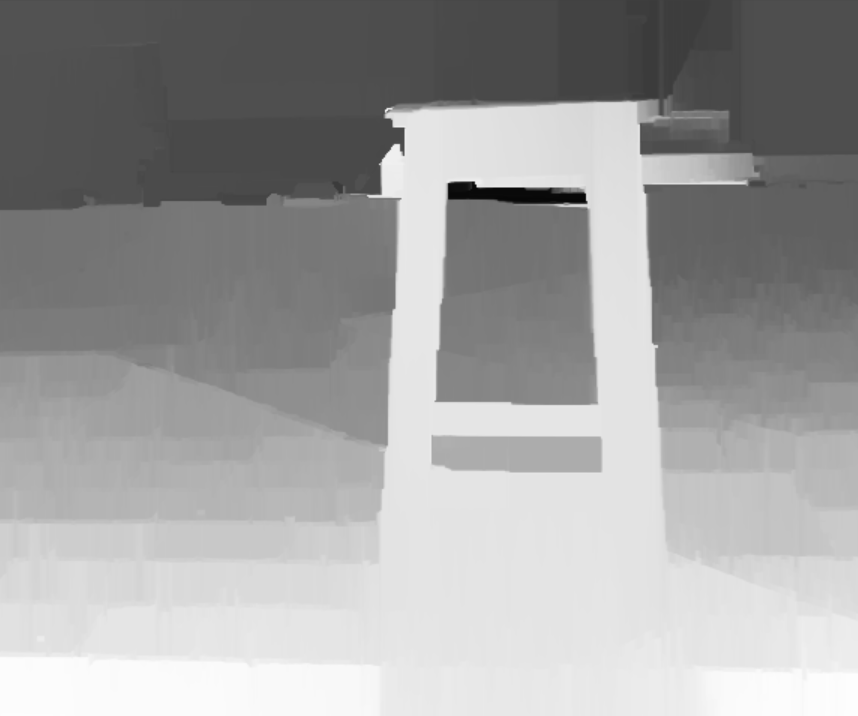
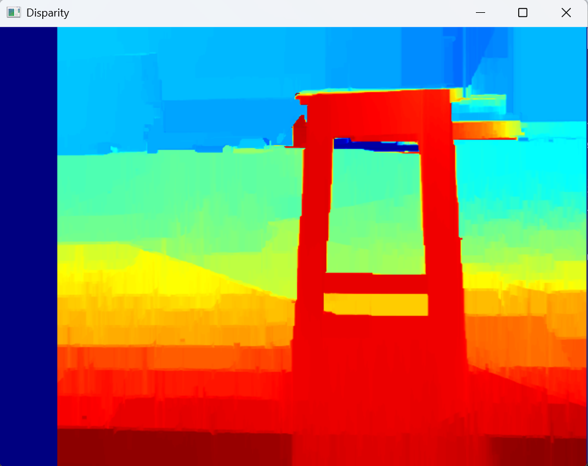
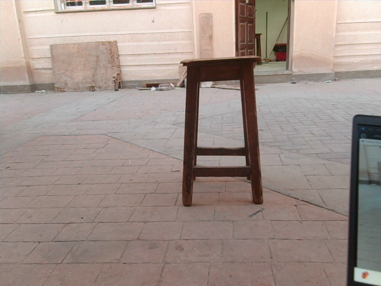
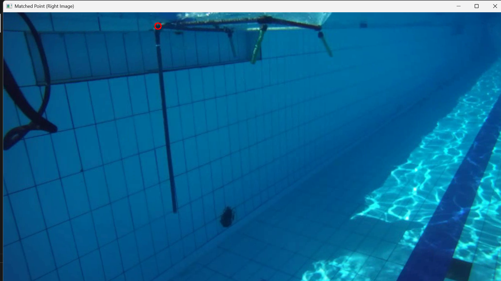

# ROV-26 Stereo Vision Measurement System

A stereo vision pipeline for underwater ROV missions — calibrate a dual-camera rig, rectify image pairs, compute disparity, and measure real-world 3D distances by clicking two points.

---

## Table of Contents

- [Pipeline Overview](#pipeline-overview)
- [Project Structure](#project-structure)
- [Installation](#installation)
- [Configuration](#configuration)
- [Quick Start](#quick-start)
- [Step-by-Step Docs](#step-by-step-docs)
- [Test cases](#test-cases)
---

## Pipeline Overview

```
[Camera Rig / Saved Frames]
         │
         ▼
   streaming.py  ──────────────────────────────► frames/camera0_N.png
                                                  frames/camera1_N.png
         │
         ▼
   calibrate.py  ──────────────────────────────► camera_parameters/
   (intrinsics → stereo extrinsics → rectify)     camera0_intrinsics.dat
                                                  camera1_intrinsics.dat
                                                  camera1_rot_trans.dat
                                                  output/rectified_left.png
                                                  output/rectified_right.png
         │
         ├──────────────────────────────────────► disparity.py
         │                                        Dense SGBM + WLS disparity map
         │                                        (visualization only)
         │
         ▼
   computing_focal.py  (fx, fy, cx, cy, Q)
         │
         ▼
   depth.py  (SAD patch match → depth per click)
         │
         ▼
   points_length.py  ──────────────────────────► 3D distance in cm
   (click 2 points → back-project → Euclidean)
```

Data flows strictly left-to-right. Each stage writes its outputs to disk so any stage can be re-run independently without repeating earlier steps.

---

## Project Structure

```
Streomeasure/
├── main.py                   # End-to-end entry point
├── settings.yaml             # All runtime configuration
├── requirements.txt
│
├── streaming.py              # Frame capture / image splitting / flipping
├── calibrate.py              # Calibration, stereo cal, rectification
├── read_calib.py             # .dat / .yaml calibration file parsers
├── computing_focal.py        # Q matrix and focal parameter loader
├── disparity.py              # Dense disparity map (SGBM + WLS)
├── depth.py                  # Per-point depth via SAD patch matching
├── points_length.py          # Interactive 3D distance measurement
├── docs/
    ├── 1__calibrating_the_stereo_camera.md
    ├── 2__rectification_image.md
    ├── 3__Disparity_map.md
    ├── 4__depth_to_body_estimation.md
    ├── 5__Length_Between_Two_Points.md
│
├── camera_parameters/        # Generated by calibrate.py
├── frames/                   # Captured frame pairs
└── output/                   # Rectified images and disparity maps
```

---

## Installation

```bash
git clone https://github.com/malak887/StereoMeasure.git
cd StereoMeasure
python -m venv .venv && source .venv/bin/activate
pip install -r requirements.txt
```

Dependencies: `numpy`, `opencv-contrib-python`, `scipy`, `pyyaml`.

---

## Configuration

Everything lives in `settings.yaml`:

```yaml
camera0: 0                        # Left camera device index
camera1: 2                        # Right camera device index
frame_width: 2360                 # Side-by-side capture width
frame_height: 720
checkerboard_box_size_scale: 0.04 # Square side in metres
checkerboard_rows: 6              # Inner corner count
checkerboard_columns: 8
baseline_cm: 12
```

---

## Quick Start

Run the full pipeline on an existing frame pair:

```bash
python main.py
```

Custom frames:   

```bash
python main.py --left frames/mission2/cam0_5.png --right frames/mission2/cam1_5.png
```

Headless:       

```bash    
python main.py --no-display
```
---

## Step-by-Step Docs

Each stage has its own detailed doc covering purpose, parameters, troubleshooting, and code examples. Read them in order when setting up from scratch.

| Step | What it does | Detailed doc |
|------|-------------|--------------|
| 1 — Calibration | Estimates intrinsics (focal length, distortion) and stereo extrinsics (R, T) from checkerboard images | [`1__calibrating_the_stereo_camera.md`](1__calibrating_the_stereo_camera.md) |
| 2 — Rectification | Warps both images so epipolar lines are horizontal; produces the Q matrix | [`2__rectification_image.md`](2__rectification_image.md) |
| 3 — Disparity map | Computes dense per-pixel disparity with SGBM and WLS filtering | [`3__Disparity_map.md`](3__Disparity_map.md) |
| 4 — Depth estimation | Converts disparity to metric depth using `Z = f·B/d` | [`4__depth_to_body_estimation.md`](4__depth_to_body_estimation.md) |
| 5 — Distance measurement | Back-projects two clicked pixels to 3D and returns Euclidean distance | [`5__Length_Between_Two_Points.md`](5__Length_Between_Two_Points.md) |

---

## Test cases
**disparity maps**




**Measuring Lengths**
```bash
Saved rectified images:
  - output\rectified_left.png
  - output\rectified_right.png
  - output\rectified_combined.png
Clicked: (334, 35)
Disparity: 61
Clicked: (389, 509)
Disparity: 53

Point 1 pixel : (334, 35)
Point 1 depth : 175.19 cm
Point 1 3D    : (np.float64(-61.338327626712974), np.float64(-61.57090684234118), np.float64(175.1913471144157))

Point 2 pixel : (389, 509)
Point 2 depth : 201.64 cm
Point 2 3D    : (np.float64(-58.14411292885834), np.float64(36.45612608711674), np.float64(201.63532403734638))

Distance      : 101.58 cm
```
the real length = 102 cm , giving an error 0.5 cm .

